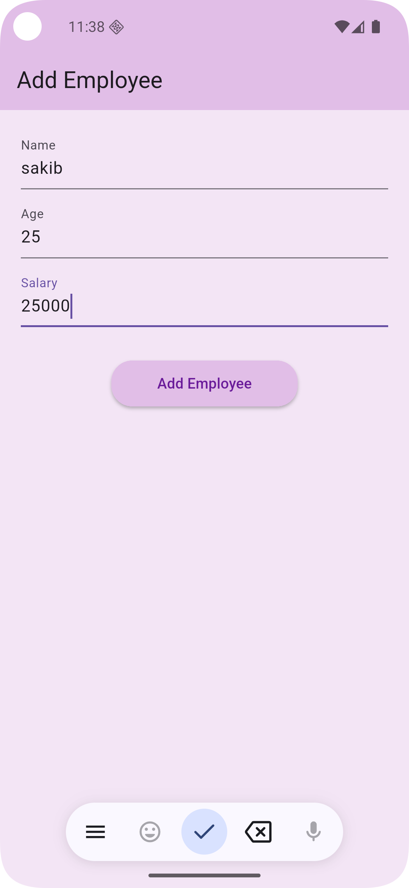

# 📋 Add Employee App

A simple Flutter application to add employee details — Name, Age, and Salary — using a clean and minimalistic UI.

---

## ✨ Features

- 📌 Input fields for Name, Age, and Salary
- 🚀 Easily extendable to connect with backend or database
- 🖱 Tap-friendly rounded submit button

---

## 🖼️ Screenshot

---

